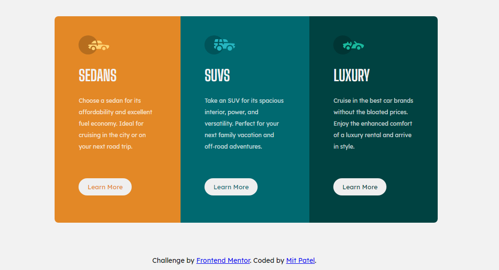

# Frontend Mentor - 3-column preview card component solution

## Table of contents

- [Overview](#overview)
  - [The challenge](#the-challenge)
  - [Screenshot](#screenshot)
  - [Links](#links)
- [My process](#my-process)
  - [Built with](#built-with)
  - [What I learned](#what-i-learned)

## Overview

### The challenge

Users should be able to:

- View the optimal layout depending on their device's screen size
- See hover states for interactive elements

### Screenshot

### Links

- [Live Site URL](https://mitp7.github.io/Column-card/)

## My process

### Built with

- Semantic HTML5 markup
- CSS custom properties
- Flexbox

### What I learned

From this challenge I learned more about flexbox and how useful it is to organize divs in to columns or rows. Using flexbox also makes it easier to format the components in a mobile view.

"# Three-column-card" 
